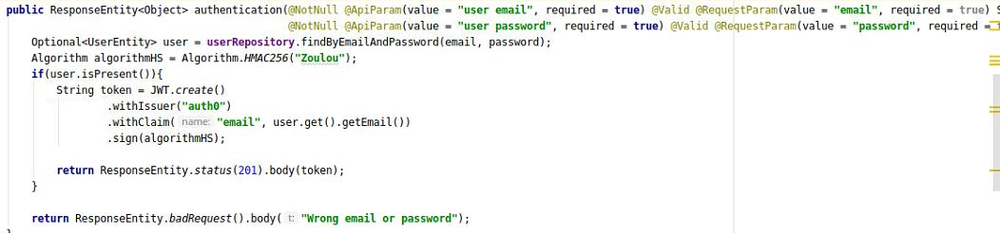

# Détail d'implémentation
Nous sommes parti sur la base de TrainingREST(Fruits) afin de commencer notre projet, la plupart des dépendences étant déjà implémentée il nous a fallu modifier le code.

Nous avons spécifié les interfaces avec Spring, ce dernier nous a généré un contrôleur auquel nous avons implémmenté nos méthodes de vérification,insértion,etc
Afin de communiquer avec la base de données il a fallu utiliser CrudRepository que nous extendions sur nos entities. Afin d'implémenter la pagination nous avons également extends PagingAndSortingRepository 

## API User

Afin de vérifier que seul un administrateur peut créer un utilisateur, nous demandons l'email ainsi que le mot de passe de l'utilisateur voulant 
créer un utilisateur, suite à ça nous vérifions si isAdmin est bien à 1 dans la DB, si c'est le cas la création est acceptée, autrement nous ne créons pas
cet utilisateur

Pour s'assurer que seul un utilisateur puisse changer son mot de passe, nous demandons, avant le changement de mot de passe, l'ancien mot de passe
afin de s'assurer que la personne qui est entrain de le changer est bien celle autorisée

Afin de générer le token JWT lorsque l'authentification est réussie nous procédons ainsi :

Il faut savoir que nous ne gérons pas la durée de vie du token et qu'il n'est réutilisé nulle part dans notre application, mais il pourrait être utilisé
si nous souhaitons accéder par exemple au dashboard du user

## API flight

Nous effectuons peu de vérifications, il est possible à n'importe qui de ajouter/supprimer/modifier un vol, le but ici a été surtout de nous familiariser
avec Spring. Notons tout de même que lorsque nous supprimons un passager, ses réservations disparaissent et si un vol est supprimé, la réservation disparaît également

Nous avons utilisé le @OneToMany dans PassengerEntity afin de pouvoir récupérer tous les vols d'un passager
