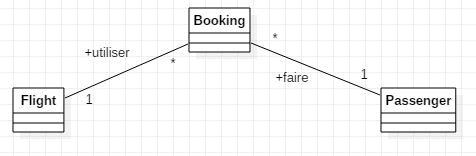

# Functional Aspect

## API flight
Nous avons ici décidé de reprendre un business domain un peu similaire au Projet One mais en l'adaptant un petit peu à la donnée de ce laboratoire
Notre but est de fournir à un passager la possibilité de réserver/gérer un vol.

Un passager a donc la possibilité d'obtenir tous ses vols, en supprimer un, en ajouter un. Si le passager est supprimé, tous ses vols le sont aussi. Pareil pour un vol, il n'existe aucune réservation de vol si le vol n'existe pas. Les opérations CRUDs ont été implémentées sur chaque main entities, ce qui permet donc l'ajout, la suppression, la modification et la lecture de ces éléments. Les données utilisées sont stockées dans une base de donnée.

La table Booking est notre table intérmédiaire qui va permettre de lier un passager à un vol. Nous avons décidé d'envoyer des payloads JSON car ce format est assez simple à comprendre et plusieurs outils permettent la traduction et c'est bien supporté par tous les navigateurs. De plus le format est assez concis : nom:valeur

## API user
Nous nous sommes contentés d'implémenter les fonctionnalités demandée dans la donnée, nous allons les rappeler brièvement
* Un compte a pour id l'email et possède un prénom, un nom et un mot de passe
* L'utilisateur peut changer son mot de passe
* Un utilisateur ne peut pas changer le mot de passe de quelqu'un d'autre
* L'utilisateur, lorsqu'il s'authentifie correctement va obtenir un token JWT
* Seul un administrateur peut créer un compte

 ## Pagination
 La pagination a été implémentée sur les méthodes getBookings, getFlights et getUsers car ce sont les méthodes sujettes à afficher un grand nombre d'éléments.
