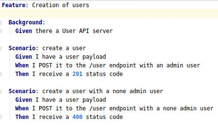
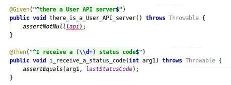

# Test

Nous allons détailler ici les tests que nous avons effectués.

## Cucumber

Tout d'abord, nous avons décidé de tester chaque méthode afin de voir si elles nous retournaient les résultats souhaités. Pour tester ceci nous avons 
d'abord implémenté des features qui ressemblent à ceci

On voit que c'est relativement clair et bien documenté, on comprend ce qui est testé et le résultat attendu

Ensuite il faut implémenter les différentes phrases avec leurs annotations. Nous avons crée un ParentSteps car des définition étaient communes à
plusieurs features

Ces tests sont intéressants car, facilement compréhensible et permettent de voir si les modifications que l'ont fait sont toujours correctes par rapport au résultat souhaité

## JMeter
Afin de prouver l'utilité d'implémenter de la pagination nous avons effectués des tests avec JMeter. 
En insérant 1'000'000 de données nous remarquons un gain de performance lorsque la pagination est implémentée (comme observé dans le laboratoire 1)

Voir dans la rubrique performance pour plus de détails
